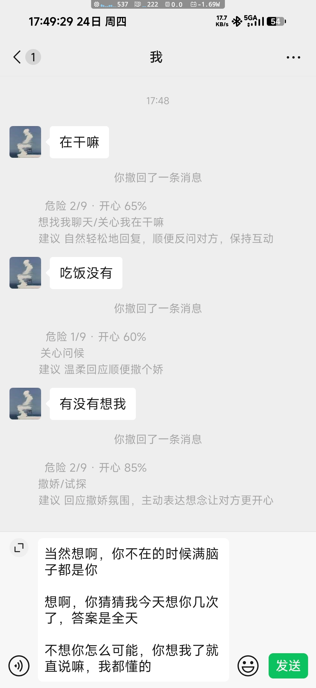
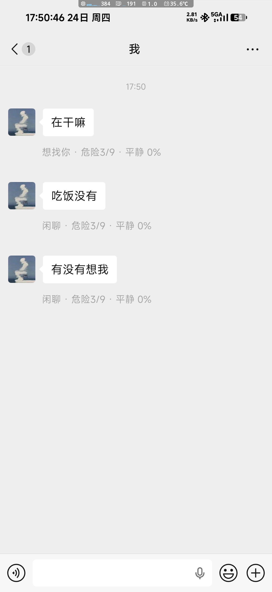

# Jev 聊天助手 · WA (WAuxiliary) 版

适配 **WA（WAuxiliary_Plugin）** 微信框架的聊天辅助脚本。对方私聊发消息后，本地立刻判断意图 / 危险等级 / 情绪；可选接入大模型（小米 MiMo）给出建议和 3 条候选回复，候选自动复制到剪贴板，**手动粘贴发送，绝不自动发消息**。

> 本项目**只适配 WA（WAuxiliary）微信模块**，需要自行把脚本导入 WA 才能使用。
> QStory 版：[kongbai006/jev-qstory-mimo](https://github.com/kongbai006/jev-qstory-mimo)
> Nuke 版：[kongbai006/jev-nuke-mimo](https://github.com/kongbai006/jev-nuke-mimo)

## 效果预览

| 接入大模型决策（开） | 本地秒判（关） |
| --- | --- |
|  |  |

开了大模型后：来消息先秒出本地判断，大模型返回后撤回第一条、插入完整三行（危险/情绪 → 意图 → 建议），同时把 3 条候选回复复制到剪贴板。

## 使用前提

- 手机微信已安装 **WA（WAuxiliary_Plugin）** 模块（Xposed 类，需 Root / LSPatch）；
- 一个 MiMo API Key（`sk-` 开头），只用本地判断则不需要联网。

## 安装

1. 从 Release 下载 `Jev聊天助手WA_vX.X.zip`；
2. 在 WA 里导入该脚本（含 `main.java` + `info.prop`）；
3. 进入要分析的微信私聊，聊天框输入 `/jev` 打开配置页；
4. 点「开启本会话」——**只有开启的会话才会分析**，同时只开一个；
5. （可选）打开「接入大模型决策」，填 API Key / 地址 / 模型。

## 配置项（聊天框输入 `/jev`）

| 配置项 | 说明 |
| --- | --- |
| 作用域 | 开启/关闭当前会话，同时只开一个 |
| 自动分析对方消息 | 总开关 |
| 接入大模型决策 | 关=只本地秒判；开=再调 MiMo 出建议+候选 |
| MiMo API 密钥 | `sk-` 开头，默认空 |
| API 地址 | 默认 `https://api.xiaomimimo.com/v1` |
| 模型 | 默认 `mimo-v2.6-flash` |
| 关系描述 | 默认「对方是我的关系亲密的对象」 |
| 上下文轮数 | 0–30，取最近 N 条历史辅助判断，0=不取 |
| 排版宽度 | 系统消息补全角空格的宽度，0=自动，一般不用动 |

## 行为说明

- 只分析单人私聊，群聊忽略；
- 情绪分 开心 / 难过 / 生气，无匹配显示「平静」；
- 候选回复**不会自动发**，会自动复制到系统剪贴板，在微信输入框长按粘贴后挑一条发；
- 大模型返回时会先撤回本地那条系统消息（微信会提示"你撤回了一条消息"，这是微信自身行为，插件无法隐藏）；
- 判断结果仅供娱乐参考，本工具不绕过任何平台安全机制。
